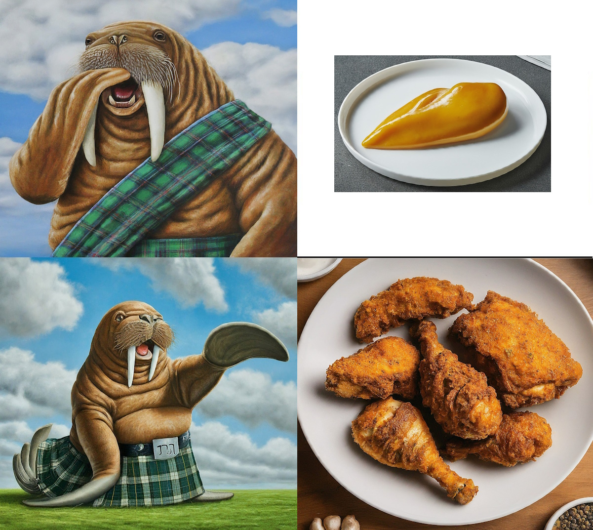

# A Website is like Fried Chicken: Why CSS Matters
By [Michael McDougal](https://heavyathlete.com/athlete/1/), aka [Marty the Scottish Mermaid](https://www.instagram.com/martythescottishmermaid/)

## Introduction: Function vs. Form

Hi there as a chemist and programmer I tend to fall on the side of function over form every time. Working on [Heavy Athlete](https://heavyathlete.com) has taught me to think a little differently. The most common feedback I received in the early days was it doesn't look like a 'real' site. What on earth is a 'real' site? I mean you say that after connecting to it on the real internet, using a real browser, it serves real data and I really worked on it. No one could give me a straight answer until one of my friends said, "Mike add some CSS and you'll really have something." I brushed it off at first. There is already CSS all over the site. I mean have you seen the tables? But in the end he was right I needed more CSS. In fact while CSS alone can't make a 'good' site without it you can't make a 'real' site.  

## The Importance of Aesthetics: From Fried Chicken to Websites
### A Recipe for a Website
- Code that does something awesome.
	- This is the meat of the project. 
	- This is what the user come to you for. 
	- This is the chicken in the fried chicken.
- HTML that renders your code in a way that ~~normies~~ users can understand.
	- This is the egg wash. 
	- With it your site is now a nice golden brown. 
- Cook to perfection in all the heat generated on the server you are abusing.

And there you have it Fried Chicken!

. . . 

What were you expecting more? Are you asking what about the breading? Where's the flavor? Maybe you'll argue that's not 'real' fired chicken. But you're wrong that is chicken, it was fried, ergo fried chicken. But it doesn't feel like 'real' fried chicken. And you're right about that feeling so lets examine a modified recipe.

### A Recipe for a 'Real' Website
- Code that does something awesome.
	- Still the meat, still the chicken. 
	- Without this you offer nothing to the user.
- HTML that covers the whole page.
	- This is still the egg wash. 
	- But now instead of being the end it is the base for you to build off of. 
	- It is ready for you to embed your signature flavor.
- CSS the breading that makes fried chicken 'real'.
	- Instead of every page looking unique cover them all in nice layer of breading. 
	- This adds a uniform experience from one piece of chicken to the next. 
	- It also adds texture so that your chicken isn't so bland.
- A dusting of JS.
	- This is the seasoning. 
	- Your salt, pepper, garlic powder and whatever else is in your bag of famous herbs and spices.
	- A little JavaScript is like a little salt, add a bit and it brings out the flavor of the chicken.
	- A lot of JavaScript is like a lot of salt, add too much and everything tastes disgusting.
- Cook on your server until golden brown; you want crispy breading holding juicy chicken.

I bet you complained at least once that I was making you hungry. That's 'real' fried chicken. So good that you remember it. So good you tell your friends about it. So good that you come back for seconds. And that's what makes a 'real' website. You can start with the best chicken on earth but if you don't prepare it correctly no one will remember it, people might eat it out of hunger but they will get no joy from it. Season your chicken and add some bread, now people will come running for more.

## Conclusion: Form Defines Function

But maybe I haven't convinced you. Maybe you like me still prefer function over form every time. Let me impart a lesson from biochemistry to you. "Form defines function." This is as true for websites as it is for enzymes. The function of CSS is to attract users. If you are making an internal tool then maybe you don't need CSS. Maybe your users will eat out of starvation. But if you want people to enjoy the experience form matters, add that breading and people will come back happily. No one complains when a meal tastes too good and no one complains when a site looks too nice.

--------------------------------------------------------
## About the Author and Heavy Athlete

This was the first article written for [HeavyAthlete.com](https://heavyathlete.com) I made Heavy Athlete as a hub for all things Scottish Highland Games. #this_was_secretly_an_ad While other people will be writing about the games, the culture, and the sport; I will mainly be writing computer related articles. Do I think that they will do as well as other peoples articles? No. I doubt this lines up with my target audience well at all. But its my site and no one can stop me. 

If you want to try the highland games, either attending or competing check out [https://heavyathlete.com](https://heavyathlete.com) 

If you want to pass General Chemistry in college download my app [ChemStud](https://chemstud.com/store/)

If you want to read more articles by yours truly then check out my next article [[Programming Languages as Explorers]]