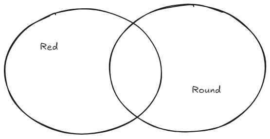

# Until there's any intelligence its not AI
By [Michael McDougal](https://heavyathlete.com/athlete/1/), aka [Marty the Scottish Mermaid](https://www.instagram.com/martythescottishmermaid/)

The current iteration of AI is woefully misunderstood by the public. The term has become so overloaded that its lost all meaning. I'm not going to fix that, I don't even know how. But I do know where to begin. When trying to understand a tangled mess the first step is usually untangling it. Let's start by tackling the biggest issue I see in AI communication "We don't really understand what's going on inside the AI". This is a load of crap. I think there is a technical term for this ... hold on it will come to me ... oh yeah skill issue. 

We can explain every step of the process for each of the unfathomably many nodes. Do you want to know the secret? These things work on graphics cards, graphics cards excel at working with matrices, matrices come from linear algebra. Let's break that name down "Linear Algebra" hmm its a mystery ... OH WAIT! I'll bet you its algebra that involves lines! The secret sauce that makes all this work is y = mx + b. We use different symbols, we don't call it a slope we call it a weight and we don't call it the y-intercept its called a bias. But its the same thing just written a different way. I'm sorry if you can't understand middle school mathematics but don't go accusing me of being as dumb as you. Now to be fair Linear Algebra is a beautiful field and has some stunning results, definitely my favorite math course I ever took. But this isn't magic, it is possible to understand these things and its time that we stop pretending like these are any more magical than a computer in general. If your understanding of a computer is "shock rocks, do numbers, make picture" then maybe skip the next section of the article it probably isn't for you although you are probably the one who needs it most.

## What's actually going on inside a LLM?

The incredible thing about linear algebra is that when we start adding new dimensions we can start expressing more and more with simple lines. If you need an amazing resource for linear algebra I can't recommend [3Blue1Brown's](https://www.youtube.com/watch?v=kjBOesZCoqc&list=PL0-GT3co4r2y2YErbmuJw2L5tW4Ew2O5B) video series on it enough. If you don't have the time for all that let me give you the tl:dr of an entire field of mathematics: 

> You know a line is all the points that meet some criteria? What if we added another criteria? Then we would have a plane (it doesn't have to be flat just like lines don't have to be straight). What if we add another criteria? Then we have a shape we call a manifold. What if we keep adding criteria? Then we keep calling them manifolds and we can't draw them anymore but the math just keeps working. And while its really hard (maybe impossible) to visualize higher dimensional shapes the intuitions from lines drawn in 2D hold up.  - Me an expert in this because I say I am

Okay so where am I going and why am I talking about this? It's those criteria I mentioned that are the important thing. It's really hard to describe something with just a single criterion (unless you cheat and use the name in the definition). Basically it either is or isn't. As an example you are going to guess what I'm thinking of.  Rest assured I am thinking of a very particular something. I have a picture latter on but lets try to describe it without that first. 

First a single criterion, its red. Now let's say for the sake of argument that there is some crazy encoding that can convert colors into numbers, maybe it would represent how red, blue, and green something is as a set of three numbers between 0-255. Lets also assume that this totally off the cuff system is named RGB. There is some section of this RGB space that covers "red" things namely anywhere that R > 0. Okay perfect we have a single description and a way to represent that fact with numbers. Can anyone guess what I'm thinking of? Maybe but I'm sure you would feel a lot better if we added more criteria and narrowed down the space from "something that is red". Before we do that there's one more important tidbit I would like to point out at this stage. Can you imagine the direction leading you towards the right answer? It's a literal direction in RGB "towards positive R".

Lets add our next criteria. I'm thinking of something round. That knowledge on its own is about as useless as knowing its red is on its own. But knowing both of these things at the same time limits the options a lot. Wheels are round but most of them aren't red. It's a classic to paint a barn red but most of them aren't round. By combining the two criteria we can get a much better estimate of what I'm thinking of. Mathematically our RGB example is now incomplete. But we can visualize this in a different way pretty easy:



Hopefully that sense of direction gets stronger here. If I dropped you in a random spot on that picture could you point in the direction you need to walk to get into the right region? Anyway lets start really ramping this up. I am going to rapid fire some criteria at you since I don't want to type this all day. The thing I'm thinking of is: red, round, alive, juicy and fruit. Hopefully most people are thinking "apple' with only a few weirdos thinking "tomato". Notice that not all of those are as helpful in narrowing things down. Most people could probably guess either apple or tomato with just red and fruit (before you think you have a clever comment about tomatoes [read this](https://www.reddit.com/r/DnD/comments/1s9l2g/dd_stats_explained_with_tomatoes/)). The way to think about this is that all of our criteria narrow the overlapping area but some carve the space more efficiently than others. This leads us to a big problem with our current approach to using LLMs. We tend to be overly reliant on explaining what we want. More criteria does help but at some point we hit diminishing returns. I could keep describing more and more and more criteria for my chosen item ... or I could start telling you things it isn't. My chosen item isn't a watercraft, it isn't made of metal, and it isn't in the nightshade family. Notice that just like positive descriptions some of these aren't as helpful as other. But hopefully everyone knows I'm talking about an apple now. I told you I had a picture so [take a gander](images/Apple-unsplash-Amit_Lahav.jpeg) if you want.

Notice I didn't keep giving you Venn Diagrams. That's because I can't draw one that has all the intersecting criteria I described without having regions that don't make sense. If only we had more directions to expand out into. This is what linear algebra allows us to do. We can make as many of these shapes that describe a criteria as we need then we can check for overlap between them. We can also tell which direction we should head if we happen to find ourselves in a random spot on in the space. This is what LLM's are doing. They start in a random space with randomly defined criteria. Then the act of training them is giving them that direction they need to head to find the answer. We tweak them, then try again, and again, and again ... until they have "learned" how to navigate this really high dimensional concept space. Using an LLM is just asking it to predict the most likely next word. The next word is just whatever word has the most concepts that came before overlapping it. When smart people say "we don't understand what's really happening" what they mean is we cant point to a part of the LLM and say here is the part that handles is something red or not.  It's not that we don't know what's happening it that we can't disentangle which part is doing what. And when there are billions of individual parts all working in unison hopefully that really isn't that surprising. 

## Natural Language isn't a sign of intelligence

Hot take but just because you can speak doesn't make you smart. In fact I think they are on disjoint axes (that is a linear algebra joke don't worry if you don't get it but it proves my point). That does pose an interesting question though. What is a sign of intelligence? I don't know and I'm willing to leave this one to the philosophers. But if there's a gun to my head and I had to answer I would say understanding is a sign of intelligence. The fact that many people don't understand the difference between holding knowledge and understanding once again proves my point. I'm sorry I'm going to stop mocking you now. For the people still confused a dictionary or encyclopedia holds a tremendous amount of information but it doesn't understand any of it. This is incredibly similar to how LLMs work. There is such an unimaginably vast amount of information encoded into a LLM and it has the ability to index and find it for you incredibly fast. But neither speed nor ease make something intelligent. Also on the matter of interfacing with machines in natural language I recommend reading Dijkstra's article [On the foolishness of "natural language programming".](https://www.cs.utexas.edu/~EWD/transcriptions/EWD06xx/EWD667.html) I won't deprive you of a good and short read but the final line deserves to be shared.

> From one gut feeling I derive much consolation: I suspect that machines to be programmed in our native tongues —be it Dutch, English, American, French, German, or Swahili— are as damned difficult to make as they would be to use.

## So where does that leave us?

Well these things aren't magic but that doesn't mean they aren't useful tools. As Dijkstra so brilliantly predicted they are damned difficult to use though. There are always two options when using a tool. First is the black box approach. Treat the tool as though it is magic. Don't understand, don't dig deeper, learn the ritual, recite the incantation and use the result. The second option when using a tool is learn the tool. Learn the guts of it, take it apart and put it back together wrong, then put it back together right. Dive deep on what makes it what it is. 

There are pros and cons to both options. Let's start with the first option. It may sound like I'm knocking this (because I have been arguing against it this whole article) but I'm not. This is a fantastic approach for anything you don't intend to specialize in. I don't particularly care how a camera works. It's a black box I point the end at someone recite, "Say cheese!" and click the button. I'm okay with the fact that I wont be winning any awards for my photos or videos anytime soon. The output of the tool I can achieve is sufficient for my purposes but in accepting that I have limited myself. Now for option two. When you get deeply familiar with the inner workings of a tool you understand way better what it can and can't do. It doesn't actually make you any better at using the tool though. Knowing how a keyboard works doesn't make you a faster typist (but using vim does). In order for there to be a tangible benefit to using the tool you have to be able to apply what you learned about it's inner workings. This takes a lot more work. Which is why for anything you don't care about or get "good enough" results for you should just use the black box method instead. But that deep knowledge can have real tangible benefits when applied correctly. You might be able to push a tool further than others, you might realize that some part of system is designed wonky and iterate to make it better, or you might make a connection to a completely different topic.

## Okay I've been paying attention so what does our insight get us for LLMs?

Remember when I mentioned we tend to be overly reliant on explaining what we want to LLMs and how that leads us to diminishing returns? I could have finished that example with one more decent criteria like "comes from a tree" but I chose to stretch the example to include negative criteria. There was a reason for that. As humans it feels strange to describe something by all the things that it isn't. Mathematically this is just a minus sign (-). There is nothing wrong with making "assertions" to sanity check ourselves. I also argued that natural language isn't the best way, as a quick recap you can't spell slaughter without laughter. If you actually read Dijkstra he talks about this better than I have. Another of his quotes from the same paper illuminates why my insight works:

>The virtue of formal texts is that their manipulations, in order to be legitimate, need to satisfy only a few simple rules; they are, when you come to think of it, an amazingly effective tool for ruling out all sorts of nonsense that, when we use our native tongues, are almost impossible to avoid.

So here's the morale of our story. If you want to align a LLM's behavior better instead of writing longer and longer prompts, or threatening its grandmother like the [Primeagen](https://www.youtube.com/@ThePrimeTimeagen), or using hundred of lines of markdown in whatever your vibe coding vehicle of choice is, talk to the LLM in a formal syntax instead. When programming using one of these tool I highly recommend [negative space programming](https://www.loskutoff.com/blog/negative-space-is-misunderstood/) also known as using asserts. I just used this to debug a ~350 line function. Trying to fit the whole thing into the context window of an LLM just led to confusion and it focusing on the wrong parts (I wasn't looking for its opinions on how it was laid out). By adding two asserts:
```python
for score in results:
	assert score.date >= start_date, f"score date: {score.date}, start date: {start_date} a bad date got through"
	assert score.date <= end_date, f"score date: {score.date}, end date: {end_date} a bad date got through"
```
I was able to show the LLM far more precisely what the problem both was and wasn't. It then immediately figured out that while I had set up and applied the filters to scores correctly:
```python
if score_filters:
	score_query = score_query.filter(and_(*score_filters))
```
I literally forgot to apply the filters to the other score tables!
```python
if claimable_filters:
	claimable_query = claimable_query.filter(and_(*claimable_filters))

if nasga_filters:
	nasga_query = nasga_query.filter(and_(*nasga_filters))
```
That was it I set up the filters but I missed these four lines of code applying them. No wonder bad dates were getting though and ruining my logic! Instead of trying to use even more flowery imperfect language a few well placed thought out assertions about how the thing should be got me what I needed so much faster and easier. I think that we need to stop training LLMs to write so many comments in the code and instead teach them to write asserts. How much easier would a back and forth be if we could just drop out of the highest level language (natural language) and into an easily verifiable one? Clearly it can make it easier for the LLM to understand us and I would wager it would be much easier if we could simply check and enforce the assumptions in code in the actual code.

Long story short I think that a lot of programmers forget that negative space programming exists (I sure don't see a ton of it on GitHub but I'm only one man) and I think that asserts give us a great intermediate representation to talk to LLMs in. Expressions that must evaluate to ```True``` or ```False``` with a simple to read comment. It's the sort of self documenting code I tell myself I should write but don't. I'm going to start using this technique more now and I hope that you do the same!


--------------------------------------------------------
## About the Author

This was the fourth article written for [HeavyAthlete.com](https://heavyathlete.com) 

I write these articles because I think of programming as 1 part engineering, 2 parts technical writing, and 1 part creative writing. Therefore the more I program the more I have a build up of creative energy. (I know I should channel this into the engineering part but damn you get creative with rendering scores for the 10th time) Since the creative energy builds up when it eventually gets too irritating I dump it all into one of these and move on :)

If you want to read more articles by yours truly then check out my next article TBD