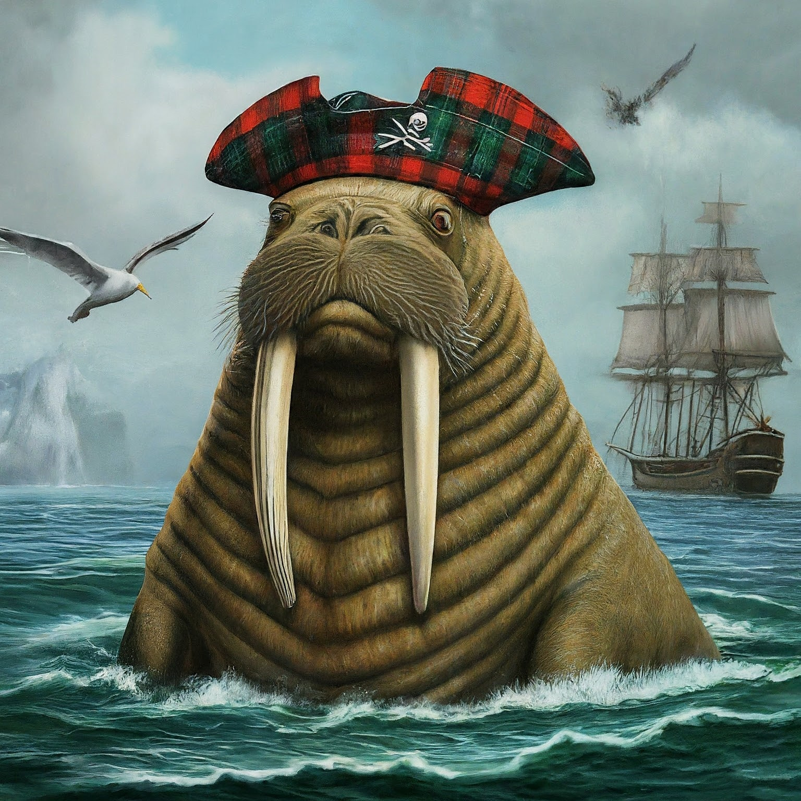

# Yet another article Personifying Languages
By [Michael McDougal](https://heavyathlete.com/athlete/1/), aka [Marty the Scottish Mermaid](https://www.instagram.com/martythescottishmermaid/)

## Disclaimer
The author has not written in all the languages mentioned in this article. That being said everything in the article is the unvarnished truth. If a language doesn't appear in this article it doesn't exist. Everything in this article has been independently fact checked by a third party, and awarded the coveted ranking of  "trust me bro".

## Why are you writing this?

Many people have personified the programming languages to try to explain them to ~~the common rabble~~ normal folks. But I've never seen anyone capture the ethos of all the languages in a single context before. This is the what I'm trying to do:

_See the source [https://engineering.ramp.com/elixir-at-ramp](https://engineering.ramp.com/elixir-at-ramp)_

But since I have no talent for art. I'm going to explain it using metaphor so without further ado.

## Explorers
### C The Legendary Explorer

You have heard the legends. Some say C discovered Atlantis, others say it was El Dorado. In truth C discovered them both. Armed only with his wits and wisdom he was the first to scale Everest and the first to see Challenger Deep. C has hunted krakens, dragons, and the occasional manticore. When a new location was rumored to exist beyond the horizon C was the first to find it. In his prime C was the guy you wanted to be more than anything. Now C is retired. His work lives on as he passed the torch to the next generation. Many have tried to mimic his ways but he belongs to the past. To a time of legends. 

### C++ The Explorer for a more civilized time

As ~~filthy casuals~~ the common man attempted to verify some of the actions the legendary explorer C, it was concluded that although we can verify that he performed the actions he claimed, we cannot replicate them using only the tools he had at his disposal. For example we know that the pyramids were built, as we can still see them today. We just don't know how they were built with the technology of the time. C++ is the one leave good enough alone. Unable to replicate C's heroic feats with only his wits and wisdom, C++ turned to invention. Sure C already circumnavigated the globe a decade before but C++ would be the first to do it in a hot air balloon. Tragically the first attempt had a memory leak and fell somewhere in the Mediterranean. Fans of this explorer claim that this was _actually_ his first successful attempt to navigate to Atlantis from the air. Undeterred by the balloon failure, C++ returned to the drawing board and constructed his new invention the aero-plane. Who cares that it was just the airplane developed by C. This one had new bells and whistles. Using his newly created and totally unique idea of the aero-plane, C++ set off to be the first to circumnavigate the globe with it. The aero-plane tragically hit a rough patch of segmentation faults over the Atlantic and C++ was eaten by coconut crabs.

### Rust The ~~scaredy cat~~ Cautious Explorer

Inspired by the capabilities of both C and C++ Rust was inspired to become an explorer. Rust adopted one of the coconut crabs that ate C++ as his mascot. This move, while it seems crazy, epitomizes Rust's mentality, it is a constant reminder to never be eaten by crabs. Rust chose not to boldly explore new lands. Opting instead to channel the spirit of C++ left in its pet crab and revisit C's accomplishments, but this time safely. Where C blazed a trail with a machete, where C++ had cleared the land with an earth mover, Rust put up safety rails for everyone. Rust distributed sunscreen even on cloudy days, cloudburn hurts just as bad guys, he made sure everyone had plenty of water to drink, and he kept talking about his girlfriend the 'borrow checker'. No you can't meet her she lives in Canada. After Rust made the roads safe to travel there was only one danger left, the drivers themselves. Rust knew that in spite of all the walls they erected, all the safety measures they put in place, for all the promises the borrow checker made that she was real, safety is shattered when users enter the scene. And so Rust began hatching their master plan. Someday soon Rust we find like minded folks and form the Rust Foundation. This shadowy organization will push a 'safe' AGI and the [First Law of Robotics](https://en.wikipedia.org/wiki/Three_Laws_of_Robotics#Zeroth_Law_added) will compel it to enslave humanity for our own safety. Until then the crab is a cute mascot.

## Capitalists
### Java The greatest Hammer Factory

To the man who is a hammer the whole world appears a nail. Truer worlds cannot be said about Java. Wherever explorers go Java follows behind. You see, explorers use tools and those tools get worn out and break. Java's motto is why have one hammer when you can have a hammer factory factory. Java tends to follow explorers and constantly ask them to update to the latest version, even though we all know its still just another hammer. As Java is in the business of making hammers and factories to produce hammers and factories to produce factories to produce hammers, there is always job opportunities with Java. Your soul with die day by day working for Java unless you love hammers. However if you work for Java to put food on the table no one blames you. 

### Python The World Serpent

As the various explorers dived deeply into ancient ruins, they found traces of a serpent god scattered across the globe. Jörmungandr to the Vikings, Quetzalcōātl to Mesoamerica, Nehebkau to ancient Egypt, and known by other names elsewhere. Only a fool would think such a terrifying beast actually exists. An entity that can ignore types, one that moves ponderously slow but consumes all resources in its path. Surely even if such a monster were real no one would be foolish enough to tap into its vast power. The truth is this monster is real and sleeps at the bottom of the ocean coiled around the whole of the planet. The ~~cultitsts~~ merchants who traveled the open sea were the first to hear and answer its call. As the great explorers discovered new resources, new untapped wells of creativity and productivity they still needed to eat. The merchants were there behind them every step of the way trading the results of the explorers discoveries for necessities. But merchants have different needs than explorers. Merchants need to move quickly, to innovate rapidly and merchants are willing to accept higher losses. If 10% of your ships are lost to the sea that can be devastating. But silver linings exist, 90% of the time you are safe so the 10% that become lost isn't really a problem with the system. Those 10% are a skill issue of incompetent merchants. The power of Python lies in its ability to consume something whole, leaving it intact and gaining its power. Nothing ever becomes Python. Instead Python wraps itself around other things. The merchants act as network taking the wonderous discoveries of the explorers and moving them around the whole world following the coils of their god deep beneath the waves. **Editors Note:** The author of this article clearly belongs to this serpent cult. Just look at the image he selected for the top of the article.

### JavaScript The Dockmaster

Sea faring merchants can't spend long on land. Their bounty lies in moving from place to place. But normal folk are more rooted. With the introduction of a global trade network to connect normal folk to the far off lands and discoveries of the explorers a new profession emerged. The dockmaster can receive goods from anywhere and repackage them to be more familiar to local audiences. He also has the power to send out local goods to connect his home port to the wide trade network. This job demands flexibility, a loose connection to sanity and a lot of showmanship. JavaScript tends to go a bit too far when selling its role in the world. As a marketing ploy JavaScript will often insert itself into a story where it doesn't belong. While the Python has the power to consume whole systems and gain their power; JavaScript can only emulate them and usually poorly. This leads to most things that exist having their story 'rewritten' to insert some JavaScript so that the dockmaster can keep his larger than life reputation alive. While JavaScript could actually go and do the things he claims to be able to, he is best suited to life on the dock receiving and transmitting others work. When JavaScript does attempt to leave his comfort zone, the entire dock tends to rise out of the water supported by giant chicken legs like Baba Yaga's hut. It then ponderously moves to its destination before sitting the entire dock back down in a foreign environment. Then he acts like it is perfectly natural to find a dock in the middle of a rainforest, miles from the closest shore.

### TypeScript The Quartermaster

Poor TypeScript powerless to do anything in this mad world. TypeScript is tasked to constantly cast its pearls before swine. TypeScript's job is to catalog all the madness entering and exiting the port. Unfortunately for TypeScript, JavaScript is still the dock master; even when that dock is currently in the middle of the jungle. All the requests TypeScript makes trying to document and make the world a safer place can be disregarded casually by JavaScript. Reliable sources have confirmed that JavaScript can't even understand the notes that TypeScript leaves in his office unless they have been transpiled into a simpler set of instructions for JavaScript. 

## Other Brave and Noteworthy Footnotes in History

While many explorers came before and many are sure to follow in the wake of these giants, I wanted to take a moment for the honorable mentions. Maybe some of these will get there own section someday.
1. All Function Languages: These are cartographers and bibliographers. They don't actually go and do the things that explorers do but they write about the best way to explore and how others did it wrong.
2. Zig: Possibly the successor to C that C++ and Rust hoped to be but could never live up too. Only time will tell but I'm rooting for the little legged snake language. She is my bet for the next legendary explorer.
3. COBOL: The goblin chieftain. Fun fact COBOL shares the root for her name with the element Cobalt. Which is a German word meaning goblin. If the goblins didn't control the world banks no one would still care about her.
4. GDScript: A mad toy maker who was inspired by Python to harness dynamic types but can still use honest real types too. His ability to move fast via interpretation while also being able to compile all his work concretely is truly futuristic. If his attention ever shifts from toys he could be quite the powerhouse.
5. Mojo: Attempting to remove the magic from Python while naming yourself after that magic is a weird move for a cult but whatever. If this cult works out it could be pretty cool.
6. Assembly: Not an explorer exactly. But just as man evolved from hominids; so to did the great explorers evolve from this proto-explorer.
7. Go: Honestly I just couldn't fit them into the metaphor. Maybe making them the train conductors of this world would work? Fast and reliable but also mainly to get things passed around.

--------------------------------------------------------
## About the Author and Heavy Athlete

This was the second article written for [HeavyAthlete.com](https://heavyathlete.com) I made Heavy Athlete as a hub for all things Scottish Highland Games. #this_was_secretly_an_ad While other people will be writing about the games, the culture, and the sport; I will mainly be writing computer related articles. Do I think that they will do as well as other peoples articles? No. I doubt this lines up with my target audience well at all. But its my site and no one can stop me. 

If you want to try the highland games, either attending or competing check out [https://heavyathlete.com](https://heavyathlete.com) 

If you want to pass General Chemistry in college download my app [ChemStud](https://chemstud.com/store/)

If you want to read more articles by yours truly then check out my next article TBD